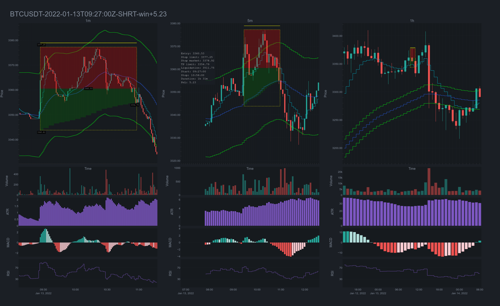
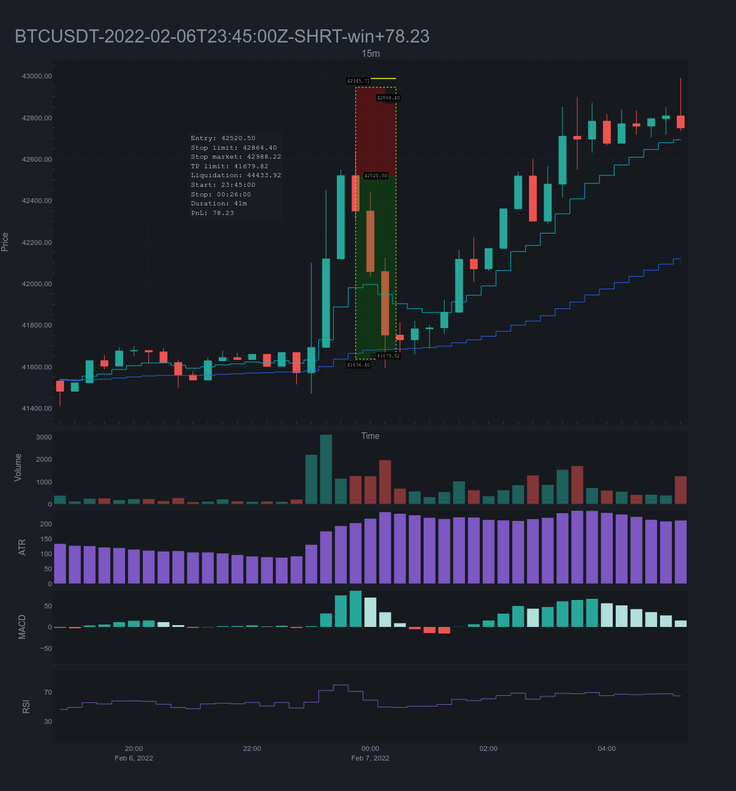
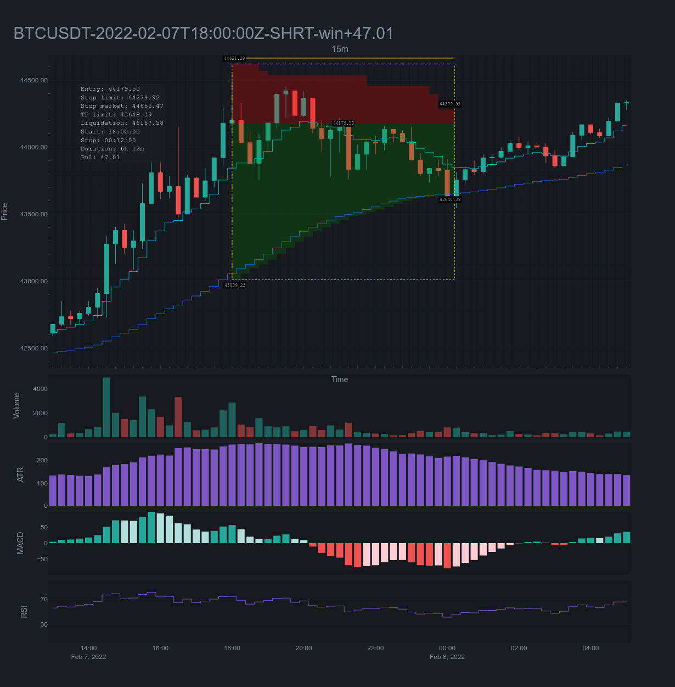
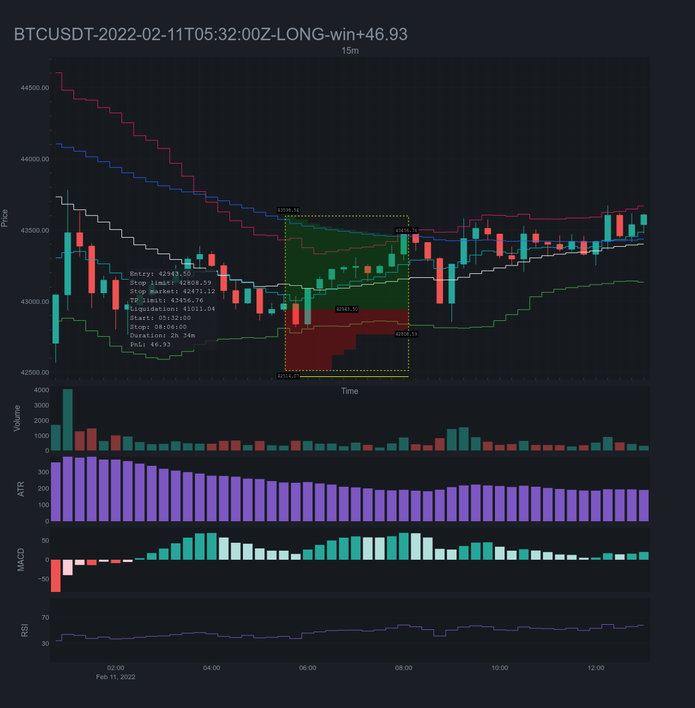
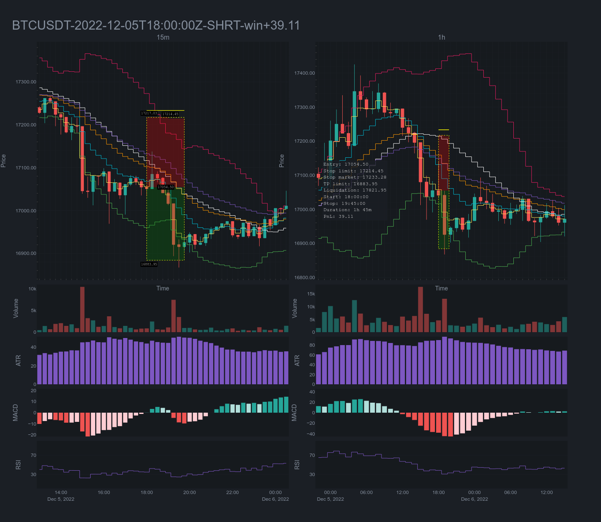
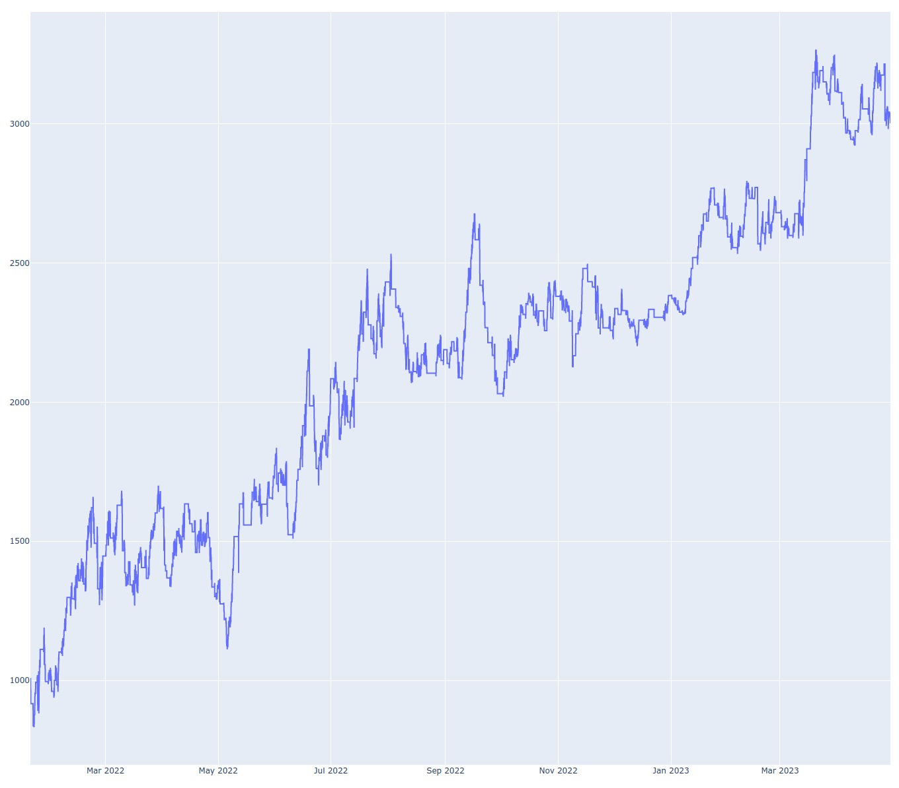
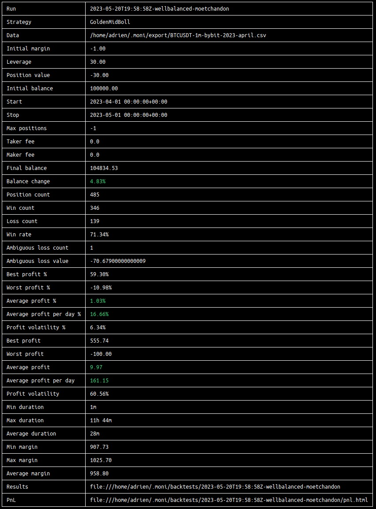
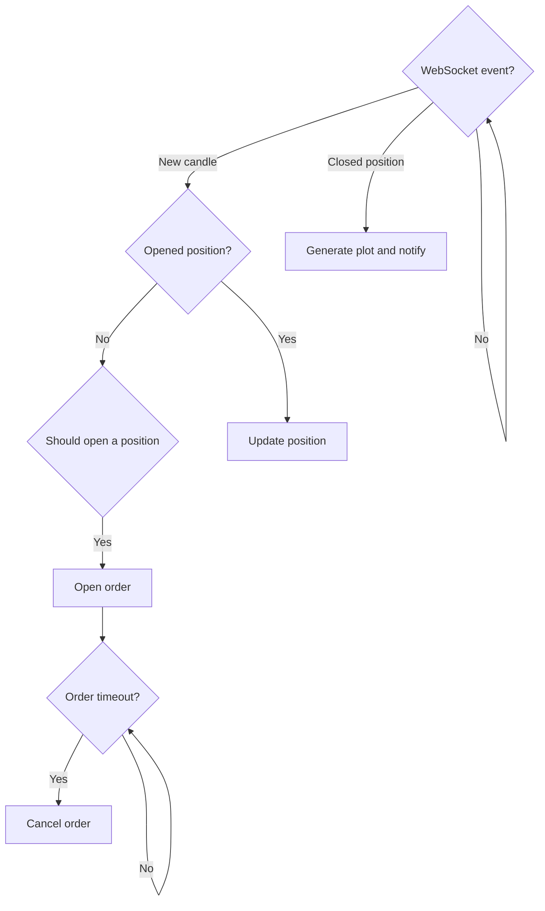

# moni-public

This repository does not provide code (yet), instead I'm sharing few information about the private `moni` project.

It annoys me to not go public but things are pretty simple, if you share a profitable trading strategy then it quickly becomes non-profitable. That said I'm considering to open source the tool (trading strategies excluded).

> Une stratégie rentable, c'est comme les bons coins à champignons, ca ne se partage pas.

## Motivation

I once read a quote from Tom Dante:

```
Welcome to the hardest game in the world.
Unfortunately, you’re playing with some of the sharpest, fastest, most intelligent,
well informed, stubbornly irrational and in many cases, unethical minds in the world.
You’re up against the computer that can react faster than you.
The trader who has more experience than you.
The fund that has more money than you.
The insider that has more information than you.
The others that will misinform you.
The inner voice that will do it’s best to undo you.
So, leave all your dreams of making quick and easy money, behind.
The first aim is survival.
Your absolute first goal is to learn how to stay in the game.
You can only do this by mapping the territory.
By understanding how the enemy thinks and acts.
By having a solid game plan.
And by picking your battles very, very carefully.
Ready to play?
```

Somehow I felt like I wanted to play. As a dev, it's really interesting in term of both architecture and reliability.

## Description

`moni` is a Python command line tool provides all required features to create / test / run any trading strategy.

## Features

Here is a non-exhaustive feature list:

### Market data

* Retrieve candle history of a symbol by date range and interval.
* Export OHLC history in CSV format.

### Backtest

* Test a strategy with a specific interval within a date range.
* Get various data result about:
    * Win rate.
    * Risk Reward.
    * Duration.
    * PnL (global, per day, per month).
* Various indicators available (ema, rsi, bb, atr, macd, volume) and the possibility to add custom ones.
* Generate **interactive** plots for each trade.
* TP/SL.

### Production

* Same features than backtests.
* Bybit derivatives compatible.
* Sub-account management.
* Set leverage.
* `systemd` configuration to run `moni` as a system service.

### Strategy building

The available API to build a strategy has only two methods to implement:
* Open position or not.
* Update position or not.

At runtime, the strategy can have access to historical data, indicators and so on.

## Basic commands

* Account / Wallet info
* Cancel all orders
* Close all positions

## Demo

### Trade sample 1



### Trade sample 2



### Trade sample 3


### Trade sample 4



### Trade sample 5



### Backtest PnL report sample



### Backtest summary report sample



## Architecture

The architecture is abstract enough to:
* be mocked and tested easily.
* minimize differences between a backtest run and a prod run, actually the only difference is how event stream is feeded (through websocket for prod and through static data for the backtest).

### Trade lifetime



### Project structure

> 12 directories, 53 files

```
moni
├── api
│   ├── binance
│   │   ├── binance_http_client.py
│   │   ├── binance.py
│   │   └── binance_queries.py
│   ├── bybit
│   │   ├── bybit.py
│   │   ├── bybit_queries.py
│   │   └── bybit_utils.py
│   ├── exchange_controller.py
│   ├── exchange.py
│   └── monibit
│       └── monibit.py
├── app
│   ├── errors.py
│   ├── exit_code.py
│   ├── logger.py
│   ├── paths.py
│   ├── settings.py
│   └── storage.py
├── bot
│   ├── analysis.py
│   ├── event_broker.py
│   ├── event_handler.py
│   ├── event.py
│   ├── exchange_callbacks.py
│   ├── exchange_executor.py
│   ├── history_provider.py
│   ├── plot_controller.py
│   └── strategy.py
├── cli
│   ├── account.py
│   ├── cli.py
│   ├── config.py
│   ├── exchange.py
│   ├── market.py
│   ├── notify.py
│   ├── order.py
│   ├── position.py
│   └── run.py
├── model
│   ├── api_model.py
│   ├── candle.py
│   ├── datasource.py
│   ├── position.py
│   └── price.py
├── tests
│   ├── functional
│   │   ├── ...
│   └── unit
│       ├── ...
└── utils
    ├── benchmark.py
    ├── dt.py
    ├── indicator.py
    ├── interval.py
    ├── number.py
    ├── output.py
    ├── plot.py
    ├── unique_name.py
    └── wait.py
```

### Modules diagram

TODO

## Acquired knowledge

* No public strategies (that you can find on medium, youtube etc) is working sustainably.
* Any profitable and sustainable strategy has losses, if not, you're probably overfitting.
* Python is not the right language here (too slow for backtesting), I'm considering to port the whole project in Rust (good occasion to learn it).

## Improvements

* Support hedging mode.
* Support average position.
* Export data required to plotting in a structured file so this step could be done by another process on demand.
* Feed strategies parameters with a config file then I create a 
* Create `metamoni` in order to backtest a 